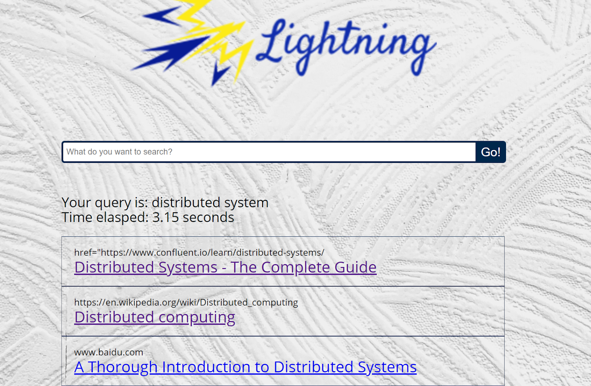
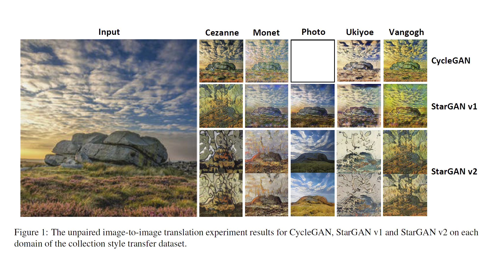

# About Me

Welcome to my Website! I am a second-year master student at [Columbia University](https://www.columbia.edu/) majoring in [Computer Science](https://www.cs.columbia.edu/)  (Machine Learning Track). I obtained my Dual Bachelor's Degree in [Computer Science](https://cse.engin.umich.edu/) at the [University of Michigan](https://umich.edu/) and in [Electrical and Computer Engineering](http://umji.sjtu.edu.cn/academics/undergraduate-program/electrical-and-computer-engineering/) at [Shanghai Jiao Tong University - Joint Institute](https://www.ji.sjtu.edu.cn/).  

I am broadly interested in Machine Learning, especially in Natural Language Processing, Computer Vision, and Deep Learning.

**Thrilled to start my career journey at [Duolingo](https://www.duolingo.com/) as a Software Engineer!**

# Education

 - **Columbia University**, New York 
   Master of Science in Computer Science || September 2021 - December 2022 
   _Cloud Computing & Big Data  &nbsp;&nbsp;&nbsp;  Intro to Database  &nbsp;&nbsp;&nbsp;   Natural Language Processing_ 
   _Operation Systems I  &nbsp;&nbsp;&nbsp;  Computer Vision II  &nbsp;&nbsp;&nbsp;   Analysis of Algorithms_ 
   _Reinforcement Learning_ 

 - **University of Michigan**, Ann Arbor 
   B.S.E in Computer Science || September 2019 - May 2021 
   _Data Structure & Algorithm &nbsp;&nbsp;&nbsp;  Intro to Computer Security &nbsp;&nbsp;&nbsp;   Web Systems_ 
   _Machine Learning  &nbsp;&nbsp;&nbsp;  Natural Language Processing &nbsp;&nbsp;&nbsp; Computer Vision_ 
   
 - **Shanghai Jiao Tong University**, Shanghai 
   B.S.E in Electrical and Computer Engineering || September 2017 - August 2021 
   _Programming & Elem. Data Structures &nbsp;&nbsp;&nbsp;  Intro to Logic Design &nbsp;&nbsp;&nbsp; Electronic Circuits_ 
   _Discrete Mathematics  &nbsp;&nbsp;&nbsp;  Honors Mathematics II-IV &nbsp;&nbsp;&nbsp;  Probabilistic Methods_ 
   
# Selected Projects

- **Automated Essay Scoring Web Application**  
 [[report]](https://drive.google.com/file/d/1CpHpMt7MNV6BHm0VayDdV3Lda2zx2ffD/view?usp=sharing) || [[video]](https://www.youtube.com/watch?v=bl1eQ_p8P2U) || [[code]](https://github.com/kySheryl/Automated_Essay_Scoring) || September 2021 - December 2021  
 Final project of COMS 6998: Cloud Computing & Big Data || Instructor: [Prof. Sambit Sahu](https://www.linkedin.com/in/sambitsahu/) and [Dr. Yuan Zhao](https://www.linkedin.com/in/yuanzhao0501/)  

<figure class="video_container">
  <iframe src="https://www.youtube.com/embed/bl1eQ_p8P2U" frameborder="0" allowfullscreen="true" width="560" height="315" allow="autoplay"> </iframe>
</figure>

   -  Solved the longstanding problem of high cost and low turnaround of current English writing tests. The goal is to shift testing away from standardized bubble tests to tests that evaluate critical thinking, problem-solving, and other 21st century skills. 
   -  Designed frontend and backend architecture and utilized AWS services to build the application, including S3, API Gateway, DynamoDB, Lambda Function, Cognito, and Sagemaker. 
   -  Deployed a user-friendly website on AWS S3 connecting with 14 pre-trained machine learning models’ endpoints on AWS Sagemaker, that could provide scores and beat rates on users’ submissions. It gives good predictions on essays with high, medium, and low performances.

- **3D Semantic Segmentation by Deep Learning**  
 [[video]](https://drive.google.com/file/d/1ixje5NcE_ymb83gApAEFUImQbMmO_TxI/view?usp=sharing) || [[code]](https://github.com/kySheryl/Cylinder3D) || May 2021 - August 2021  
 Capstone Project at Shanghai Jiaotong University || Instructor: Dr. Mingjian Li & Dr. Hao Sun  

<figure class="video_container">
  <iframe src="https://drive.google.com/file/d/1ixje5NcE_ymb83gApAEFUImQbMmO_TxI/preview" frameborder="0" allowfullscreen="true" width="640" height="400" allow="autoplay"> </iframe>
</figure>

   - Captured real scenes using Lidar sensor and collected corresponding Lidar point cloud data
   - Improved baseline segmentation model, Cylinder3D, including data encoding, model architecture, and loss function
  
- **High-speed Search Engine from Scratch in C++**  
 [[report]](https://drive.google.com/file/d/172UXSwlVx6K-J8qx5WTSIrOv6gCFIlqn/view?usp=sharing) || [[slides]](https://drive.google.com/file/d/1DxhTrliO5wprU14PspebUXWQ6MANsFDH/view?usp=sharing) || January 2021 - April 2021 
 Final project of [EECS 440: System Design of a Search Engine](https://web.eecs.umich.edu/~nham/Documents/EECS440%20System%20Design%20of%20a%20Search%20Engine%20Supporting%20Statement.pdf) || Instructor: [Prof. Nicole Hamilton](https://web.eecs.umich.edu/~nham/)  
        
   - Established an index constructor and compresses total disk usage to 2TB by serializing term posting lists using UTF-8 encoding and document deltas when writing index chunks from memory to disk
   - Ranked retrieved pages using fine-tuned heuristics and static page attributes to achieve a >70% precision

 - **Commonsense Reasoning for Natural Language Inference**  
 [[report]](https://drive.google.com/file/d/1e2F1MXjMZfJ_ymvXaxk6PqaC8NPzYvB6/view?usp=sharing) || [[slides]](https://drive.google.com/file/d/1_r0xKUZ7wcuSkiD8BQtdVEE2Hq1gVNzv/view?usp=sharing) || October 2020 - December 2020 
 Final project of EECS 595: Natural Language Processing || Instructor: [Prof. Joyce Chai](https://web.eecs.umich.edu/~chaijy/)  
   - Explored large benchmarks and pretrained models like BERT and Roberta. Applied transfer learning and finetuning skills to develop reasoning frameworks for NLI tasks, including Question Answering, Conversation Entailment and Plausible Inference.

- **Unpaired Image-to-Image Style Transfer with Generative Adversarial Networks**  
 [[report]](https://drive.google.com/file/d/1r4-549KdIAUmINvfRvzW2fOA2AFVxkZ7/view?usp=sharing) || [[slides]](https://drive.google.com/file/d/1N4qXzuiKlcYaWnZiPL7Po-4vuQDtiL10/view?usp=sharing) || [[code]](https://github.com/Mars-tin/unpaired-image-to-image-translation) || October 2020 - December 2020 
 Final project of [EECS 442: Computer Vision](https://www.eecs.umich.edu/courses/eecs442-ahowens/fa20/) || Instructor: [Prof. Andrew Owens](http://andrewowens.com/)  
         
  - Conducted research on the application of Generative Adversarial Networks on image-to-image translation. Reproduced CycleGAN, StarGAN v1, and StarGAN v2 models for artistic image style transferring and performed quantitative evaluation with FID score and classification accuracy.

# Work Experience    

- **Software Engineering Intern** 
   [Duolingo, Inc.](https://www.duolingo.com/) || May 2022 - August 2022 
    - Developed unit assignment prototype with Python (for backend) and TypeScript/React (for frontend) on Duolingo for Schools
    - Implemented API supports for create, edit, and delete unit assignments, built methods for handling the SNS events, triggering push
notifications, and sending student-facing emails, and updated frontend Teacher Dashboard
    - Cooperated with product design team on implementation details and designed metrics for user onboarding flow experiment
 
 - **Instructional Aide ([EECS498-004 Introduction to Natural Language Processing](https://web.eecs.umich.edu/~wangluxy/courses/eecs498_wn2021/eecs498_wn2021.html))**  
   University of Michigan || Instructor: [Prof. Lu Wang](https://web.eecs.umich.edu/~wangluxy/) || January 2021 - April 2021 
   - Design and grade assignments, answer students' questions on piazza, hold office hours   
    
 - **Teaching Assistant (VP141 Physics Lab I)**  
   Shanghai Jiao Tong University || Instructor: [Mateusz Krzyzosiak](https://www.ji.sjtu.edu.cn/about/faculty-staff/faculty-directory/faculty-detail/97/) || May 2019 - August 2019 
 
 - **Teaching Assistant (VY100/VY200 Academic Writing I, II)**  
   Shanghai Jiao Tong University || Instructor: [Angela Gehling](https://www.linkedin.com/in/angela-gehling-22127b54/) || September 2018 - May 2019 
   
   
# Research Experience

 - **Deep Learning Model for Making Predictions on Shotgun Metagenomic Sequencing Data** 
   Instructed by [Prof. Itsik Pe'er](http://www.cs.columbia.edu/~itsik/) and Vanesa Getseva  || [[slides]](https://drive.google.com/file/d/1Df2jjk7JoAZsq2yeCDjwpytBX70wm89G/view?usp=sharing) || September 2021 - December 2021  
    - Conduct literature research on shotgun metagenomic sequencing data and collect datasets with proper number of subjects, samples, and time intervals.
    - Deploy a recurrent neural network (RNN) to make predictions on shotgun metagenomic sequencing data and compare its performance to the performance of traditional Markovian models.

 - **Summary Error Evaluation Project** 
   Instructed by [Prof. Lu Wang](https://web.eecs.umich.edu/~wangluxy/) || September 2020 - May 2021  
    - Evaluate summary quality by annotating four types of un-faithful content and conduct research on abstractive document summarization generation models and summary error evaluations.

 - **Deep Learning Research on [1Cademy](https://1cademy.com/), a Large-scale Research Platform** 
   With [Iman Yeckehzaare](https://www.si.umich.edu/people/iman-yeckehzaare) || [[codes]](https://github.com/kySheryl/Predicting-Long-term-Student-Engagement-Cognitive-Psychology-in-Deep-Knowledge-Tracing) || [[videos]](https://www.youtube.com/watch?v=HJTQ9zHfJ1Y&list=PLgfGk2XWE_oA58aWUQ-BPYo5Bi7Sy35mh) || June 2020 - April 2021 
    - Lead weekly meeting of deep learning research team where team members collaboratively researching recent techniques and algorithm regarding applying deep reinforcement learning to improving human learning.
   
 - **Mapleseed: Sensor Network Laboratory** 
   Instructed by [Prof. Xiaogan Liang](https://me.engin.umich.edu/people/faculty/xiaogan-liang) || [[report]](https://drive.google.com/file/d/1gY-ltsIQgOeHnJThU-AwPFc2KwvJwqGN/view?usp=sharing) || January 2020 - April 2021  
    - Real-time image classification on a NVIDIA Jetson Nano GPU board of particles’ images captured by the optical microscopes on a fast drone.
